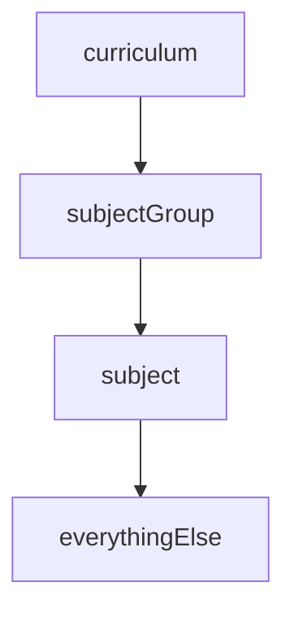

# Admin Panel Global Filter

TL;DR

A new global subject group filter will be added to the admin panel, enabling subject leads to apply a persistent filter for content related to their subject across the platform. Accessible via a settings modal, the filter will reduce manual filtering efforts by storing preferences in local storage, maintaining them across sessions. Key features include persistent filtering, local storage integration, and a hierarchy branch fetch function to streamline content management. While this enhances efficiency, potential improvements include optimising resource retrieval with materialised views and addressing filter reset issues in React Admin.

 

## Background

Our content hierarchy has the following soft structure

Our Admin Panel is used by many different subject leads who primarily only care about content related to their subject (Maths, Physics, ESS, etc). The admin panel has many different resources that allow manual filtering for those subjects, but it only saves per resource.

## Problem

When subject leads are wanting to create/view/edit content that is related to their own subject, they currently need to manually add a filter to all the current filter hierarchies for each individual resource (topics, subtopics, exam papers, etc). Subject leads are currently looking to be able to have their subject group filter propagate throughout the whole site for all content related to their subject group. This would be a time saving feature, especially when they are trying to create a resource within a hierarchy, as it doesn't have the same persistent filtering that is on the list pages.

## Solution

A global filter will be added to the admin panel that will allow any user to add a global subject filter to the site. Whatever the subject group that is selected, every resource that within the subject group hierarchy will be filtered with only those entries.

The filter will be available in a settings modal that is accessible on any resource the current user is on. On changing the filter, it will update the current pages filters to replicate the new subject group (or if the subject group is removed, it will no longer filter just for that group).

The filter will be stored using local storage so that the filter will remain between page loads, and different user sessions.

### Key additions

- Settings Modal & Toolbar Button
  - Adds a settings modal accessible via a button on the toolbar to manage global subject group filters.
- Global Filter Priority
  - Implements a global filter priority for subject groups, ensuring consistency across hierarchy-based filters site-wide.
- Persistent Filtering Across Pages
  - Enables the global subject group filter to apply persistently, affecting hierarchy filters on create/edit pages and other filter-dependent sections.
- Local Storage Integration
  - Stores global filter settings in local storage, maintaining user preferences between sessions.
- Hierarchy Branch Fetch Function
  - Introduces a function to retrieve a branch from the hierarchy based on subject groups.

### Considerations

By adding this extra filtering per page, the initial loading of resources are significantly slower than before, but this does mean that the user no longer has to manually add each filter, to get to the same stage (which is relatively much quicker).

## Learnings

### Efficiency

The way that we currently filter in the admin panel is quite inefficient as we have to find either the ids of the resource you're looking for, or you need to find the id of the immediate parent. To do this at the moment, we need to fetch all the resources above it starting from the subject (using the subject group as a filter for that). This means that we essentially need to make `d` requests where `d is the depth of the tree`. Sometimes more when there are many-to-many relationships that require a couple extra fetches.

A potential optimisation we can make here is to add a new materialized view for each of the different branch hierarchies, and then customise the fetch so that we can pass a level to the filter, and then the subject group that we are wanting for that group. This does require more database storage, but would drastically speed up the fetch process of these requests.

### React admin resetting filters

There isn't a nice way to clear filters for the whole site as react admin stores filters in the query params, and then saves it to local storage on a per resource basis. The stored information is kept in a key that looks like `RaStore.{resource}.listParams`. If we changes the filter, we can't (in a nice way) clear all the existing filters for the resources, and then also only remove those that are no longer in the new subject group filter. So this just means that a user will need to be aware that if they are using the filter for a subject, then changing to a different subject. The last filters will likely still be active, and they will need to manually clear it. This isn't the best user experience, but we don't have a great solution to solve this one just yet.

## Potential Improvements

- Add new materialized view for each of the hierarchy branches.
- Add an endpoint that allows fetching for a level, and then passing in a filter.
- Clear existing page filters when global filter is changed, especially if the filter selected doesn't belong in the subject group.

## Conclusion

In conclusion, implementing a global subject group filter in the admin panel marks a significant improvement in the efficiency and usability for subject leads managing their specific content. By introducing a global filter accessible via a settings modal, we can reduce the manual filtering burden on users, streamlining the process of creating and editing resources across different sections of the platform.

While this solution offers convenience and a more cohesive experience, there are areas for future refinement. Loading times may initially slow due to additional filtering layers, even though the overall workflow is expected to become more efficient for users. Optimising resource retrieval through a materialised view for hierarchy branches and enhancing the filtering mechanism in React Admin could further improve performance and user satisfaction. With these changes, we look forward to a more seamless experience for subject leads, with continued exploration of optimisations and potential solutions to address current limitations in filter resetting across different sections of the site.
